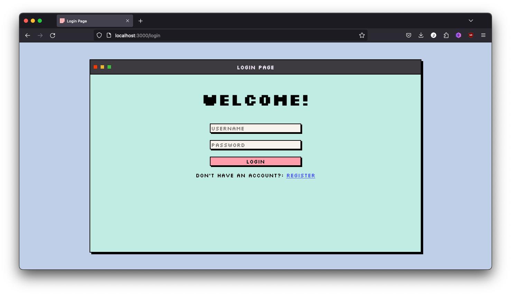
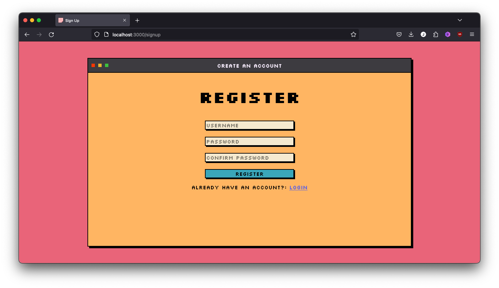
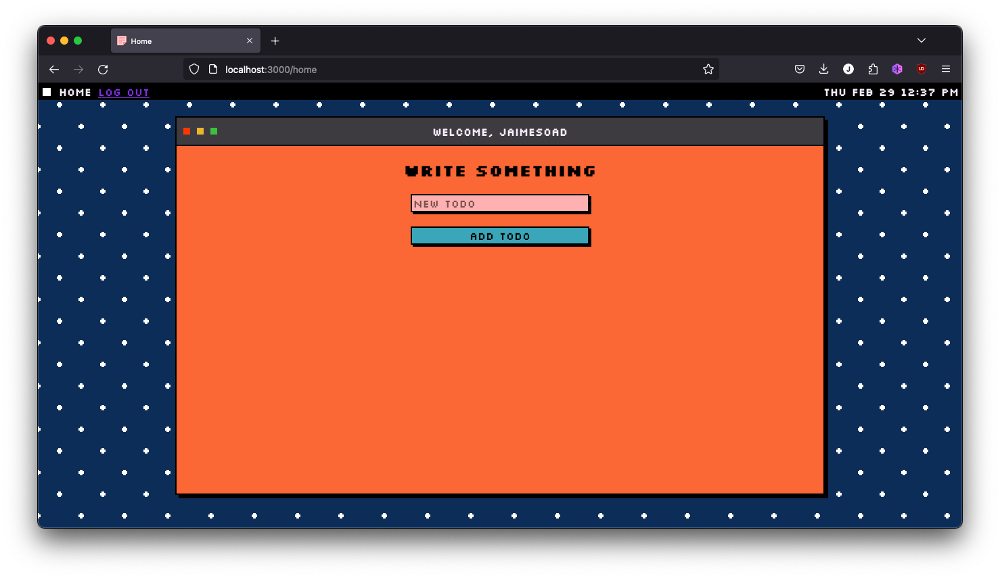
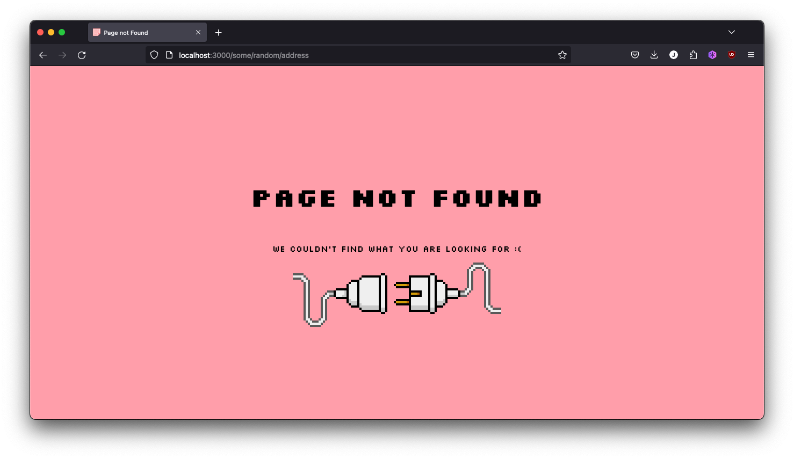

# Todo app

## Run the application

Before running the application you will need to setup 
your enviromnent variables in a `.env` file. The environment variables needed are:
1. `DBHOST`: (optional) set it up only if you run the application outside docker or the database is hosted elsewhere.
2. `POSTGRES_USER`: The user for the database.
3. `POSTGRES_PASSWORD`: The user's password.
4. `SECRET`: A random string of characters for the JWT (JSON Web Tokens).

Once you set up your environment variables, you're ready to run the application:
```bash
docker compose up
```

## Inside the application
Head to `http://localhost:3000` in your browser and it'll redirect you to the login page, there you can either log in or create an account.

## Screenshots







